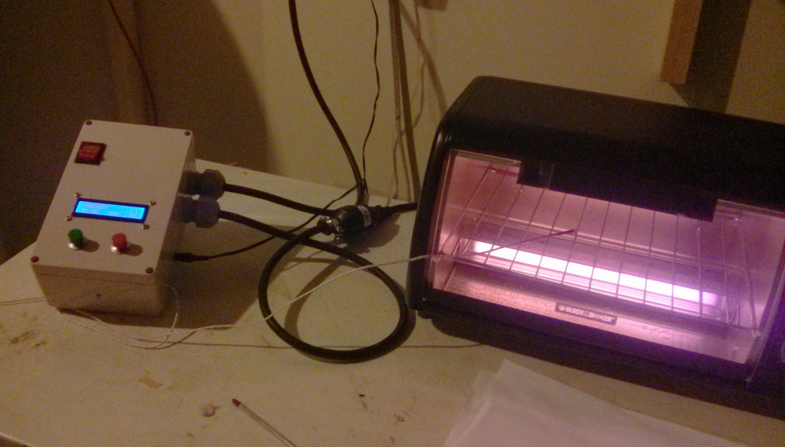

# reflow-toaster-controller
Arduino based controller that turns a toaster oven into a reflow oven for reflow soldering

Uses a K-type thermocopuple connected to a MAX6675 module to add PID control to a toaster oven through a SSR. See the comments in reflow_main.ino for pin assignments and more information.
